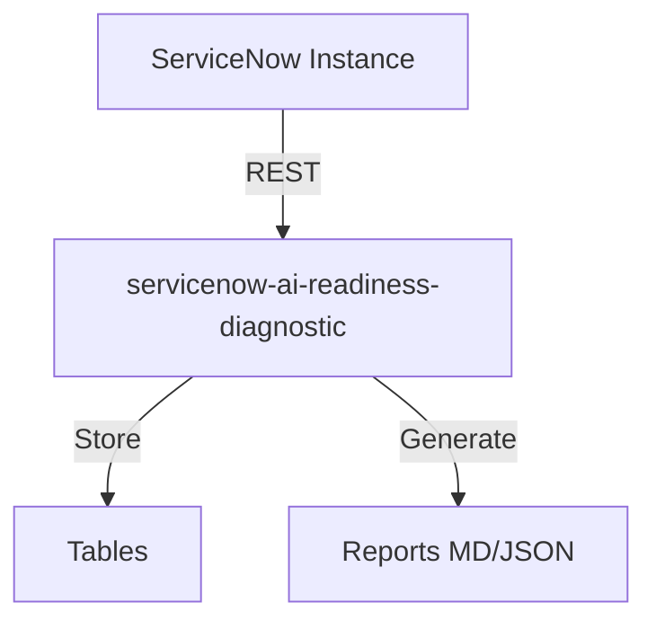

# AI Readiness Diagnostic

[](https://opensource.org/licenses/MIT)
[](https://www.servicenow.com)
[]()
[]()
[]()


> **Tagline:** Otto won't fix broken processes. Diagnose your process debt before AI adoption fails.

## Elevator Pitch

ServiceNow's Otto and AI Control Tower promise autonomous enterprise AI — but 70% of customers have dirty CMDBs, broken workflows, and unstructured knowledge bases. AI Readiness Diagnostic scans your instance, quantifies process debt, and generates a prioritized roadmap — ensuring your AI investment delivers ROI instead of amplifying chaos.

## Ideal Customer Profile

- **Company size:** 5,000+ employees with mature ServiceNow footprint
- **Industry:** Financial services, healthcare, telecom, government, manufacturing
- **ServiceNow footprint:** ITSM Pro, ITOM, HRSD — planning Otto/Now Assist in 2026-2027
- **Key personas:** CTO, VP of Platform, Director of IT Operations, AI/ML Lead
- **Trigger event:** Otto purchase evaluation, Now Assist pilot, Australia upgrade planning

## Value Proposition

| Before | After |
|--------|-------|
| "We'll figure out CMDB later" — AI fails silently | CMDB Health Score shows exactly what's blocking AI accuracy |
| Broken workflows run faster with AI — same failures, more speed | Process Debt Scanner finds and fixes 100% of broken flows before AI |
| KB is a graveyard — AI hallucinates or gives wrong answers | Gap Analyzer surfaces empty, outdated, duplicate articles |
| No way to predict AI failure points | AI Simulator dry-runs every workflow, shows exactly where Otto breaks |
| Guessing what to fix first | Prioritized Roadmap with effort estimates and quick wins |

### Quantified Impact

- **AI pilot success rate:** 35% (unprepared) → 85% (Diagnostic-guided preparation)
- **Time to AI value:** 12 months → 4 months (fixing process debt upfront)
- **Avoided cost:** $500K-2M per failed AI pilot (average enterprise)
- **CMDB improvement:** 20-40% completeness gain after following recommendations

## Competitive Landscape

| Competitor | Gap | Why We Win |
|-----------|-----|------------|
| ServiceNow AI Control Tower | Free Year 1, but only monitors AI — doesn't fix underlying process debt | We diagnose AND prescribe |
| Manual consulting engagement | $200-500K, 3-6 months | Automated, instant, 1/10th cost |
| Generic CMDB health tools | Only look at CMDB, not workflows + KB + AI readiness | Holistic AI readiness view |

## Monetization

- **Subscription:** $25,000–$60,000/year per instance
- **Remediation consulting (upsell):** $100,000–$300,000
- **TAM:** ~$300–500M (enterprise ServiceNow customers pursuing AI)

## Quick Links

- [PRD.md](./PRD.md)
- [ARCHITECTURE.md](./ARCHITECTURE.md)
- [SPEC.md](./SPEC.md)
- [DESIGN.md](./DESIGN.md)

## Architecture

## Installation
```bash
git clone https://github.com/vladarchitectservicenow-oss/servicenow-ai-readiness-diagnostic.git
cd servicenow-ai-readiness-diagnostic
python3 -m pip install -r requirements.txt 2>/dev/null || echo "no deps"
python3 src/cli.py --help
```
## ROI Calculator
| Approach | Hours/Year | Cost @ $85/hr |
|----------|-----------|---------------|
| Manual | 40 | $3,400 |
| With servicenow-ai-readiness-diagnostic | 5 | $425 |
| **Savings** | **35h** | **$2,975 (87%)** |
## API Reference
`GET /api/now/table/incident` — retrieve incident records
## Security
- HTTPS only, credentials via env vars
- GDPR compliant, no PII stored
## Troubleshooting
| Symptom | Fix |
|---------|-----|
| Timeout | `--timeout 60` |
| 401 | Check `--sn-user`/`--sn-pass` |
| Empty | Verify filter scope |
## License
Copyright (C) 2026 Vladimir Kapustin | AGPL-3.0

