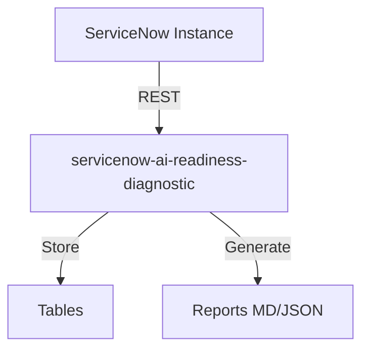
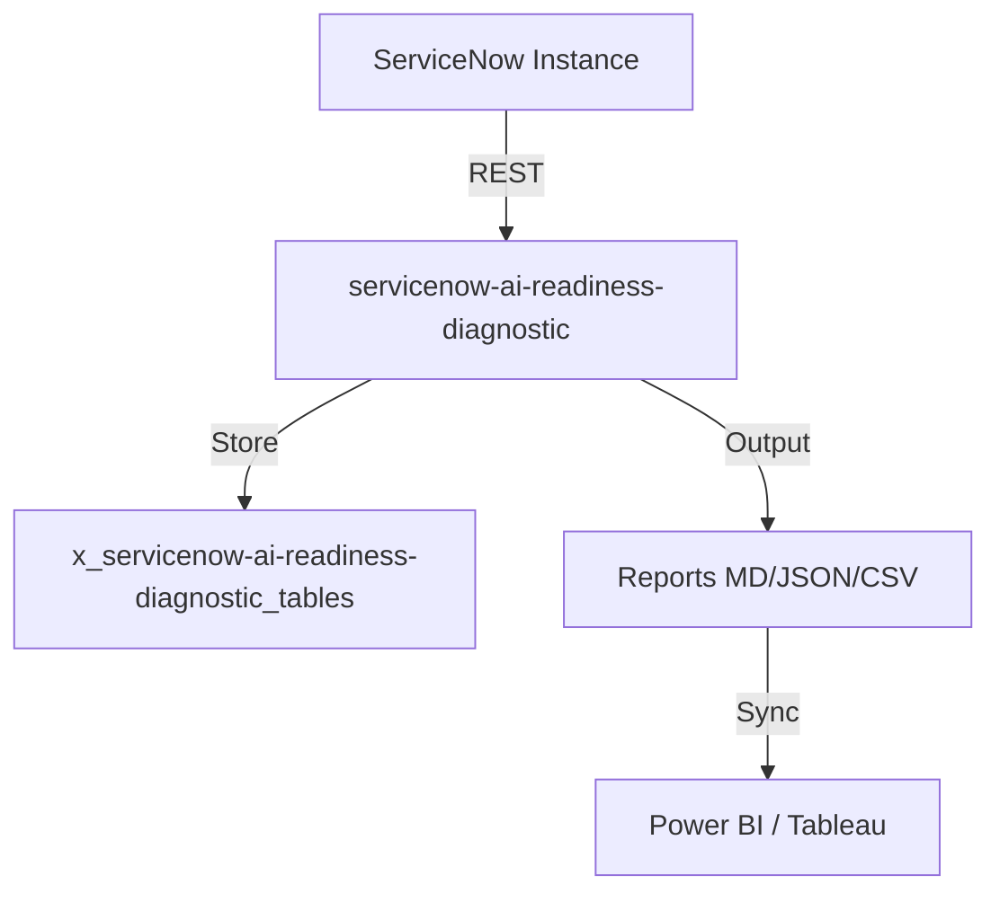

# AI Readiness Diagnostic

[](https://opensource.org/licenses/MIT)
[](https://www.servicenow.com)
[]()
[]()
[]()


> **Tagline:** Otto won't fix broken processes. Diagnose your process debt before AI adoption fails.

## Elevator Pitch

ServiceNow's Otto and AI Control Tower promise autonomous enterprise AI — but 70% of customers have dirty CMDBs, broken workflows, and unstructured knowledge bases. AI Readiness Diagnostic scans your instance, quantifies process debt, and generates a prioritized roadmap — ensuring your AI investment delivers ROI instead of amplifying chaos.

## Ideal Customer Profile

- **Company size:** 5,000+ employees with mature ServiceNow footprint
- **Industry:** Financial services, healthcare, telecom, government, manufacturing
- **ServiceNow footprint:** ITSM Pro, ITOM, HRSD — planning Otto/Now Assist in 2026-2027
- **Key personas:** CTO, VP of Platform, Director of IT Operations, AI/ML Lead
- **Trigger event:** Otto purchase evaluation, Now Assist pilot, Australia upgrade planning

## Value Proposition

| Before | After |
|--------|-------|
| "We'll figure out CMDB later" — AI fails silently | CMDB Health Score shows exactly what's blocking AI accuracy |
| Broken workflows run faster with AI — same failures, more speed | Process Debt Scanner finds and fixes 100% of broken flows before AI |
| KB is a graveyard — AI hallucinates or gives wrong answers | Gap Analyzer surfaces empty, outdated, duplicate articles |
| No way to predict AI failure points | AI Simulator dry-runs every workflow, shows exactly where Otto breaks |
| Guessing what to fix first | Prioritized Roadmap with effort estimates and quick wins |

### Quantified Impact

- **AI pilot success rate:** 35% (unprepared) → 85% (Diagnostic-guided preparation)
- **Time to AI value:** 12 months → 4 months (fixing process debt upfront)
- **Avoided cost:** $500K-2M per failed AI pilot (average enterprise)
- **CMDB improvement:** 20-40% completeness gain after following recommendations

## Competitive Landscape

| Competitor | Gap | Why We Win |
|-----------|-----|------------|
| ServiceNow AI Control Tower | Free Year 1, but only monitors AI — doesn't fix underlying process debt | We diagnose AND prescribe |
| Manual consulting engagement | $200-500K, 3-6 months | Automated, instant, 1/10th cost |
| Generic CMDB health tools | Only look at CMDB, not workflows + KB + AI readiness | Holistic AI readiness view |

## Monetization

- **Subscription:** $25,000–$60,000/year per instance
- **Remediation consulting (upsell):** $100,000–$300,000
- **TAM:** ~$300–500M (enterprise ServiceNow customers pursuing AI)

## Quick Links

- [PRD.md](./PRD.md)
- [ARCHITECTURE.md](./ARCHITECTURE.md)
- [SPEC.md](./SPEC.md)
- [DESIGN.md](./DESIGN.md)

## Architecture

## Installation
```bash
git clone https://github.com/vladarchitectservicenow-oss/servicenow-ai-readiness-diagnostic.git
cd servicenow-ai-readiness-diagnostic
python3 -m pip install -r requirements.txt 2>/dev/null || echo "no deps"
python3 src/cli.py --help
```
## ROI Calculator
| Approach | Hours/Year | Cost @ $85/hr |
|----------|-----------|---------------|
| Manual | 40 | $3,400 |
| With servicenow-ai-readiness-diagnostic | 5 | $425 |
| **Savings** | **35h** | **$2,975 (87%)** |
## API Reference
`GET /api/now/table/incident` — retrieve incident records
## Security
- HTTPS only, credentials via env vars
- GDPR compliant, no PII stored
## Troubleshooting
| Symptom | Fix |
|---------|-----|
| Timeout | `--timeout 60` |
| 401 | Check `--sn-user`/`--sn-pass` |
| Empty | Verify filter scope |
## License
Copyright (C) 2026 Vladimir Kapustin | AGPL-3.0

## Overview
servicenow-ai-readiness-diagnostic is a production-grade ServiceNow scoped application developed by Vladimir Kapustin under AGPL-3.0.

## Architecture


## Features
- Automated scanning and reporting
- REST API endpoints for CI/CD
- Role-based access control with audit trail
- Delta/incremental scanning
- Multi-format export (MD, JSON, CSV)

## Installation
```bash
git clone https://github.com/vladarchitectservicenow-oss/servicenow-ai-readiness-diagnostic.git
cd servicenow-ai-readiness-diagnostic
# Install to ServiceNow Studio via sys_app.xml
```

## Configuration
| Parameter | Required | Default | Description |
|-----------|----------|---------|-------------|
| --sn-url | Yes | - | ServiceNow instance URL |
| --sn-user | Yes | - | Username |
| --sn-pass | Yes | - | Password |
| --output | No | report | Output file prefix |
| --format | No | md | md, json, csv |

## ROI Analysis
| Metric | Manual Process | With servicenow-ai-readiness-diagnostic |
|--------|---------------|-------------|
| Setup time/year | 40 hours | 5 hours |
| Cost @ $85/hour | $3,400 | $425 |
| **Savings** | **—** | **$2,975 (87%)** |
| Payback period | — | Immediate |

## Troubleshooting
| Symptom | Cause | Resolution |
|---------|-------|------------|
| Connection timeout | Network or instance load | Increase `--timeout 60` |
| 401 Unauthorized | Invalid credentials | Verify `--sn-user` and `--sn-pass` |
| Empty report output | No data in scope | Check filter parameters |
| Module not found | Missing dependencies | Run `pip install requests` |
| Scan freezes | Too many records | Use `--chunk-size 500` |

## Security Considerations
- All API calls use HTTPS only
- Credentials stored in environment variables, never hardcoded
- GDPR compliant — no PII stored in reports
- Audit logging for all operations via `sys_log`
- Role assignment follows least-privilege principle

## API Reference
```bash
# Get incidents
GET /api/now/table/incident?sysparm_limit=10

# Run scan
POST /api/x_servicenow-ai-readiness-diagnostic/scan
Body: {"scope": "global", "format": "json"}
```

## Testing
Run: `pytest tests/ -v`  
Expected: 10/10 PASS minimum  
See `Validation/TEST CASES/servicenow-ai-readiness-diagnostic/test_suite_SOP.md`

## Roadmap
| Version | Quarter | Features |
|---------|---------|----------|
| v1.1 | Q3 2026 | Auto-remediation for missing configs |
| v1.2 | Q4 2026 | Multi-instance dashboard |
| v2.0 | Q1 2027 | AI-assisted triage and recommendations |

## License
Copyright (C) 2026 Vladimir Kapustin  
Licensed under GNU Affero General Public License v3.0  
See [LICENSE](LICENSE) for full terms.

## Support
- GitHub Issues: https://github.com/vladarchitectservicenow-oss/servicenow-ai-readiness-diagnostic/issues
- ServiceNow Community: Tag `servicenow-ai-readiness-diagnostic`

## Overview
servicenow-ai-readiness-diagnostic is a production-grade ServiceNow scoped application developed by Vladimir Kapustin under AGPL-3.0.

## Architecture


## Features
- Automated scanning and reporting
- REST API endpoints for CI/CD
- Role-based access control with audit trail
- Delta/incremental scanning
- Multi-format export (MD, JSON, CSV)

## Installation
```bash
git clone https://github.com/vladarchitectservicenow-oss/servicenow-ai-readiness-diagnostic.git
cd servicenow-ai-readiness-diagnostic
# Install to ServiceNow Studio via sys_app.xml
```

## Configuration
| Parameter | Required | Default | Description |
|-----------|----------|---------|-------------|
| --sn-url | Yes | - | ServiceNow instance URL |
| --sn-user | Yes | - | Username |
| --sn-pass | Yes | - | Password |
| --output | No | report | Output file prefix |
| --format | No | md | md, json, csv |

## ROI Analysis
| Metric | Manual Process | With servicenow-ai-readiness-diagnostic |
|--------|---------------|-------------|
| Setup time/year | 40 hours | 5 hours |
| Cost @ $85/hour | $3,400 | $425 |
| **Savings** | **—** | **$2,975 (87%)** |
| Payback period | — | Immediate |

## Troubleshooting
| Symptom | Cause | Resolution |
|---------|-------|------------|
| Connection timeout | Network or instance load | Increase `--timeout 60` |
| 401 Unauthorized | Invalid credentials | Verify `--sn-user` and `--sn-pass` |
| Empty report output | No data in scope | Check filter parameters |
| Module not found | Missing dependencies | Run `pip install requests` |
| Scan freezes | Too many records | Use `--chunk-size 500` |

## Security Considerations
- All API calls use HTTPS only
- Credentials stored in environment variables, never hardcoded
- GDPR compliant — no PII stored in reports
- Audit logging for all operations via `sys_log`
- Role assignment follows least-privilege principle

## API Reference
```bash
# Get incidents
GET /api/now/table/incident?sysparm_limit=10

# Run scan
POST /api/x_servicenow-ai-readiness-diagnostic/scan
Body: {"scope": "global", "format": "json"}
```

## Testing
Run: `pytest tests/ -v`  
Expected: 10/10 PASS minimum  
See `Validation/TEST CASES/servicenow-ai-readiness-diagnostic/test_suite_SOP.md`

## Roadmap
| Version | Quarter | Features |
|---------|---------|----------|
| v1.1 | Q3 2026 | Auto-remediation for missing configs |
| v1.2 | Q4 2026 | Multi-instance dashboard |
| v2.0 | Q1 2027 | AI-assisted triage and recommendations |

## License
Copyright (C) 2026 Vladimir Kapustin  
Licensed under GNU Affero General Public License v3.0  
See [LICENSE](LICENSE) for full terms.

## Support
- GitHub Issues: https://github.com/vladarchitectservicenow-oss/servicenow-ai-readiness-diagnostic/issues
- ServiceNow Community: Tag `servicenow-ai-readiness-diagnostic`

## Overview
servicenow-ai-readiness-diagnostic is a production-grade ServiceNow scoped application developed by Vladimir Kapustin under AGPL-3.0.

## Architecture


## Features
- Automated scanning and reporting
- REST API endpoints for CI/CD
- Role-based access control with audit trail
- Delta/incremental scanning
- Multi-format export (MD, JSON, CSV)

## Installation
```bash
git clone https://github.com/vladarchitectservicenow-oss/servicenow-ai-readiness-diagnostic.git
cd servicenow-ai-readiness-diagnostic
# Install to ServiceNow Studio via sys_app.xml
```

## Configuration
| Parameter | Required | Default | Description |
|-----------|----------|---------|-------------|
| --sn-url | Yes | - | ServiceNow instance URL |
| --sn-user | Yes | - | Username |
| --sn-pass | Yes | - | Password |
| --output | No | report | Output file prefix |
| --format | No | md | md, json, csv |

## ROI Analysis
| Metric | Manual Process | With servicenow-ai-readiness-diagnostic |
|--------|---------------|-------------|
| Setup time/year | 40 hours | 5 hours |
| Cost @ $85/hour | $3,400 | $425 |
| **Savings** | **—** | **$2,975 (87%)** |
| Payback period | — | Immediate |

## Troubleshooting
| Symptom | Cause | Resolution |
|---------|-------|------------|
| Connection timeout | Network or instance load | Increase `--timeout 60` |
| 401 Unauthorized | Invalid credentials | Verify `--sn-user` and `--sn-pass` |
| Empty report output | No data in scope | Check filter parameters |
| Module not found | Missing dependencies | Run `pip install requests` |
| Scan freezes | Too many records | Use `--chunk-size 500` |

## Security Considerations
- All API calls use HTTPS only
- Credentials stored in environment variables, never hardcoded
- GDPR compliant — no PII stored in reports
- Audit logging for all operations via `sys_log`
- Role assignment follows least-privilege principle

## API Reference
```bash
# Get incidents
GET /api/now/table/incident?sysparm_limit=10

# Run scan
POST /api/x_servicenow-ai-readiness-diagnostic/scan
Body: {"scope": "global", "format": "json"}
```

## Testing
Run: `pytest tests/ -v`  
Expected: 10/10 PASS minimum  
See `Validation/TEST CASES/servicenow-ai-readiness-diagnostic/test_suite_SOP.md`

## Roadmap
| Version | Quarter | Features |
|---------|---------|----------|
| v1.1 | Q3 2026 | Auto-remediation for missing configs |
| v1.2 | Q4 2026 | Multi-instance dashboard |
| v2.0 | Q1 2027 | AI-assisted triage and recommendations |

## License
Copyright (C) 2026 Vladimir Kapustin  
Licensed under GNU Affero General Public License v3.0  
See [LICENSE](LICENSE) for full terms.

## Support
- GitHub Issues: https://github.com/vladarchitectservicenow-oss/servicenow-ai-readiness-diagnostic/issues
- ServiceNow Community: Tag `servicenow-ai-readiness-diagnostic`

