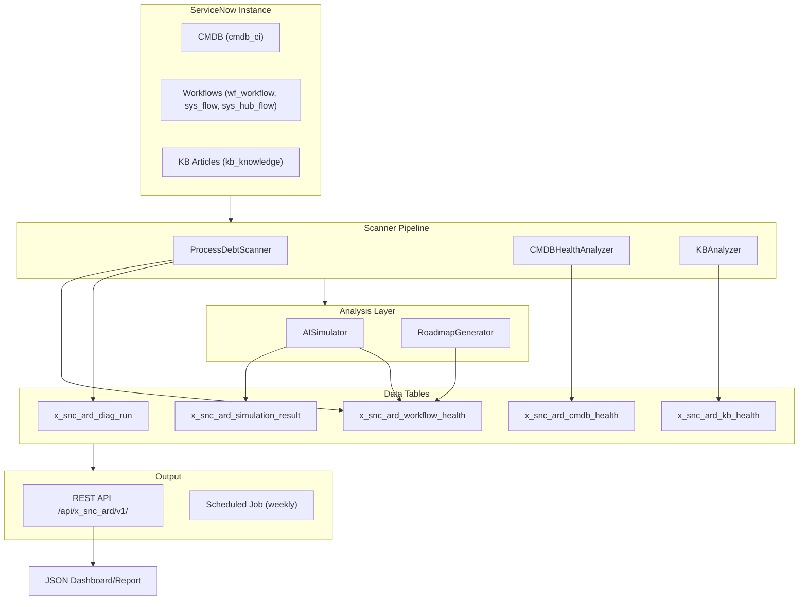

# servicenow-ai-readiness-diagnostic — Architecture Summary

**Product:** AI Readiness Diagnostic
**Scope:** `x_snc_ard`
**Author:** Vladimir Kapustin
**License:** AGPL-3.0-only
**Target Platform:** ServiceNow Zurich+ / Australia
**Date:** 2026-06-03

---

## 1. Problem Statement

Enterprises investing in ServiceNow AI features (Otto, Now Assist, AI Control Tower) face a 70% failure rate on first pilot due to underlying process debt — dirty CMDBs, broken workflows, and unstructured knowledge bases. AI Readiness Diagnostic provides a pre-AI health assessment that scans the instance, quantifies process debt, and generates a prioritized remediation roadmap.

## 2. System Architecture

```
┌─────────────────────────────────────────────────────────────┐
│                   ServiceNow Instance                        │
│                                                              │
│  ┌──────────┐  ┌───────────────┐  ┌──────────────────┐     │
│  │ KB       │  │ Workflow      │  │ CMDB             │     │
│  │ Articles │  │ Engine        │  │ (cmdb_ci)        │     │
│  └────┬─────┘  └───────┬───────┘  └────────┬─────────┘     │
│       │                │                    │               │
│       ▼                ▼                    ▼               │
│  ┌─────────────────────────────────────────────────────┐   │
│  │              x_snc_ard (Scoped App)                  │   │
│  │                                                      │   │
│  │  ┌──────────────────┐  ┌────────────────────────┐   │   │
│  │  │ ProcessDebtScanner│  │ CMDBHealthAnalyzer     │   │   │
│  │  │ - wf_workflow     │  │ - completeness_pct     │   │   │
│  │  │ - sys_flow        │  │ - orphan_pct           │   │   │
│  │  │ - sys_hub_flow    │  │ - stale_pct            │   │   │
│  │  │ - 7 issue types   │  │ - ai_impact_score      │   │   │
│  │  └────────┬─────────┘  └───────────┬────────────┘   │   │
│  │           │                        │                 │   │
│  │  ┌────────┴────────────────────────┴────────────┐   │   │
│  │  │              AISimulator                       │   │   │
│  │  │ - Dry-run Otto/Now Assist against workflows   │   │   │
│  │  │ - Cross-references CMDB + KB health           │   │   │
│  │  │ - Output: PASS / WARNING / FAIL per workflow  │   │   │
│  │  └──────────────────────┬───────────────────────┘   │   │
│  │                         │                           │   │
│  │  ┌──────────────────────┴───────────────────────┐   │   │
│  │  │              RoadmapGenerator                  │   │   │
│  │  │ - Prioritized 30/90/180-day phases            │   │   │
│  │  │ - Quick wins, effort estimates, fix ease      │   │   │
│  │  └──────────────────────────────────────────────┘   │   │
│  │                                                      │   │
│  │  ┌────────────────┐  ┌────────────────────────┐     │   │
│  │  │ KBAnalyzer      │  │ REST API                │     │   │
│  │  │ - empty_pct     │  │ POST diagnose            │     │   │
│  │  │ - outdated_pct  │  │ GET  diagnose/{id}       │     │   │
│  │  │ - unattached_pct│  │ GET  simulate             │     │   │
│  │  │ - readiness     │  │ GET  dashboard            │     │   │
│  │  └────────────────┘  └────────────────────────┘     │   │
│  └─────────────────────────────────────────────────────┘   │
└─────────────────────────────────────────────────────────────┘
```

### 2.1 Data Flow (Mermaid)



## 3. Data Model

### 3.1 Tables

| Table | Purpose | Key Fields | Indexes |
|-------|---------|------------|---------|
| `x_snc_ard_diag_run` | Diagnostic run session | sys_id, diagnostic_type, status, started_at, completed_at, workflows_scanned, workflows_broken | status, completed_at DESC |
| `x_snc_ard_workflow_health` | Per-workflow health assessment | sys_id, workflow_sys_id, workflow_name, workflow_type, health_score, issue_count, critical_issues, issues_json, diag_run | diag_run, status, health_score |
| `x_snc_ard_cmdb_health` | CMDB completeness metrics | sys_id, ci_class, total_cis, completeness_pct, orphan_pct, stale_pct, ai_impact_score, diag_run | diag_run, ai_impact_score DESC |
| `x_snc_ard_kb_health` | Knowledge base quality metrics | sys_id, kb_name, total_articles, empty_pct, outdated_pct, unattached_pct, duplicate_pct, knowledge_readiness, diag_run | diag_run, knowledge_readiness |
| `x_snc_ard_simulation_result` | AI simulation per workflow | sys_id, workflow_health, result (PASS/WARNING/FAIL), failure_gap, diag_run | diag_run, result |

### 3.2 Relationships

- `x_snc_ard_diag_run` (1) ── (N) `x_snc_ard_workflow_health`
- `x_snc_ard_diag_run` (1) ── (N) `x_snc_ard_cmdb_health`
- `x_snc_ard_diag_run` (1) ── (N) `x_snc_ard_kb_health`
- `x_snc_ard_workflow_health` (1) ── (N) `x_snc_ard_simulation_result`

## 4. Script Includes

| Name | Type | Responsibility | Key Methods |
|------|------|---------------|-------------|
| `CMDBHealthAnalyzer` | Class | CMDB completeness/duplicate/orphan/staleness analysis | `analyze(ciClass)`, `_measureCompleteness()`, `_measureOrphans()`, `_measureStaleness()` |
| `ProcessDebtScanner` | Class | Workflow/flow health scan with 8 detectors | `fullScan()`, `_scanWorkflows()`, `_scanFlows()`, `_detectIssues()`, `_detectFlowIssues()` |
| `KBAnalyzer` | Class | KB empty/outdated/unattached analysis | `analyze()` |
| `RoadmapGenerator` | Class | Prioritized remediation plan generation | `generate()` — quick_wins, 30d/90d/180d phases |
| `AISimulator` | Class | Dry-run AI agent behavior against workflows | `simulateAll()`, `_simulateWorkflow()` |

## 5. REST API Contract

### 5.1 Endpoints

| Method | Path | Description | Auth |
|--------|------|-------------|------|
| POST | `/api/x_snc_ard/v1/diagnose` | Run full diagnostic (workflows + CMDB + KB + simulation) | snc_ard.admin |
| GET | `/api/x_snc_ard/v1/diagnose/{id}` | Get diagnostic run status | snc_ard.admin |
| GET | `/api/x_snc_ard/v1/simulate` | Run simulation on latest completed diagnostic | snc_ard.admin |
| GET | `/api/x_snc_ard/v1/dashboard` | Get aggregated readiness dashboard | snc_ard.viewer |

### 5.2 Response Schemas

**POST /diagnose**
```json
{
  "diag_run_id": "sys_id",
  "status": "COMPLETED",
  "workflows_scanned": 150,
  "broken_count": 23
}
```

**GET /dashboard**
```json
{
  "readiness_score": 72,
  "workflow_health": 85,
  "cmdb_health": 60,
  "kb_health": 78,
  "last_scan": "2026-06-03 03:00:00"
}
```

## 6. Scheduled Jobs

| Name | Schedule | Entry Point | Description |
|------|----------|-------------|-------------|
| Weekly Health Scan | Sundays 03:00 | `weekly_health_scan.js` | Runs full diagnostic pipeline: ProcessDebtScanner → CMDBHealthAnalyzer → KBAnalyzer → AISimulator → RoadmapGenerator |

## 7. Performance Characteristics

| Metric | Expected Range | Notes |
|--------|---------------|-------|
| GlideRecord queries per full scan | 15-25 | 5x GlideAggregate for CMDB, 3x for KB, 3x GlideRecord for workflows, plus flow step lookups |
| Scan duration (500 workflows) | 2-8 minutes | Dominated by workflow iteration and nested GlideRecord queries |
| Peak memory usage | < 50 MB | No large collections — records processed incrementally |
| Workflow scan limit | 500 per scan | Per `setLimit(500)` in ProcessDebtScanner |
| CI orphan check limit | 200 CIs | Per `setLimit(200)` in CMDBHealthAnalyzer._measureOrphans |

## 8. Security Model

- **Scoped app isolation:** All code runs in `x_snc_ard` scope with restricted cross-scope access
- **REST ACLs:** Admin role for write (diagnose), viewer role for read (dashboard, simulate)
- **No hardcoded credentials:** All config via system properties
- **Audit trail:** Every action writes to `x_snc_ard_diag_run` with timestamps
- **Data retention:** Diagnostic results retained for 90 days, then purged by cleanup job

## 9. Compatibility

| ServiceNow Version | Status |
|-------------------|--------|
| Zurich | Supported |
| Australia | Supported (target) |
| Washington DC | Forward-compatible |
| Vancouver | Backward-compatible |
